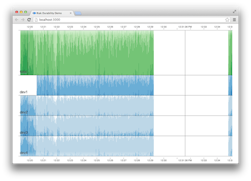

## Overview

This application is designed to allow for demonstrating the durability of a Riak cluster.



## Pre-requisites

  1. You must already have a [Riak](http://docs.basho.com/riak/latest/downloads/) cluster (devrel setups work fine) running and configured to use this application effectively.
  2. You must have [node.js](http://nodejs.org/download/) installed w/ npm.

## Installation

    $ git clone git://github.com/nathanaschbacher/riak-durability-demo.git
    $ cd riak-durability-demo
    $ npm install

## Usage

Make sure to modify the `config.json` file to match your environment.

```
{
	"settings": {
			"max_objects": 100000,
			"max_duration": 10,
			"max_concurrent": 500
		},
	"riak": {
		"nodes": [
			{ "name": "dev1", "host": "localhost", "port": 10018 },
			{ "name": "dev2", "host": "127.0.0.1", "port": 10028 },
			{ "name": "dev3", "host": "localhost", "port": 10038 },
			{ "name": "dev4", "host": "127.0.0.1", "port": 10048 }
		]
	}
}
```

* `settings`
    * `max_objects`: this is the total number of generated objects to load into the `demo` bucket in Riak.
    * `max_duration`: is the total time in minutes to run the demo. Set this to `null` to run indefinitely.
    * `max_concurrent`: is the max number of operations allowed to be queued/buffered.  This puts a limit on node.js's buffering of http requests so that they don't keep piling up while waiting for Riak to respond to prior operations.

* `riak`
    * `nodes`: an `Array` of `Objects` defining the tags, host and http port of the Riak nodes in the demo cluster.
        * `name`: is specifically used in the generation and collection of metrics, so what you set as a node's name is what will show up as its graph title in the dashboard.
        * `host`: the node's host address.
        * `port`: the node's http port.


Then run: 

    $ npm start 
    
from the root directory of the application.  This will start generating load against the configured Riak cluster and, if you're running this from a Mac, open a new browser window pointed at `http://localhost:3000` for viewing the demo dashboard.  

If you get a browser error, refresh the page.  It's likely that the express.js app just didn't start up fast enough to serve up the page before the browser tried to load it.

## License

(The MIT License)

Copyright (c) 2013 Nathan Aschbacher

Permission is hereby granted, free of charge, to any person obtaining
a copy of this software and associated documentation files (the
'Software'), to deal in the Software without restriction, including
without limitation the rights to use, copy, modify, merge, publish,
distribute, sublicense, and/or sell copies of the Software, and to
permit persons to whom the Software is furnished to do so, subject to
the following conditions:

The above copyright notice and this permission notice shall be
included in all copies or substantial portions of the Software.

THE SOFTWARE IS PROVIDED 'AS IS', WITHOUT WARRANTY OF ANY KIND,
EXPRESS OR IMPLIED, INCLUDING BUT NOT LIMITED TO THE WARRANTIES OF
MERCHANTABILITY, FITNESS FOR A PARTICULAR PURPOSE AND NONINFRINGEMENT.
IN NO EVENT SHALL THE AUTHORS OR COPYRIGHT HOLDERS BE LIABLE FOR ANY
CLAIM, DAMAGES OR OTHER LIABILITY, WHETHER IN AN ACTION OF CONTRACT,
TORT OR OTHERWISE, ARISING FROM, OUT OF OR IN CONNECTION WITH THE
SOFTWARE OR THE USE OR OTHER DEALINGS IN THE SOFTWARE.